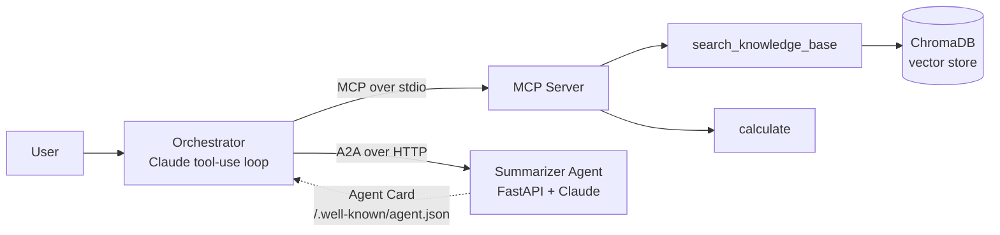

# Agentic RAG Assistant

A command-line AI assistant that answers questions from your own documents, calls tools through **MCP**, and delegates work to a specialist agent through **A2A**. Claude decides which capability to use at each step.


## Why this project

LLMs don't know your private data, hallucinate, are unreliable at arithmetic, and can't take actions on their own. This project addresses each problem:

| Problem | Solution in this project |
|---|---|
| Doesn't know your documents | **RAG**: retrieve relevant chunks and ground the answer in them |
| Hallucinates | Strict grounding prompt, mandatory citations, and an explicit "I don't know" fallback |
| Bad at exact math | A safe **calculator tool** exposed over MCP |
| Can't specialize | A separate **summarizer agent** reached over A2A |

## Architecture



**Flow of a request:** the orchestrator sends your question and the available tools to Claude. Claude either answers directly or requests a tool call. The orchestrator executes it (an MCP call or an A2A HTTP request), returns the result to Claude, and repeats until Claude produces a final answer (capped at 6 steps).

## Features

- **RAG pipeline:** document loading, overlapping chunking, local embeddings, cosine-similarity retrieval with ChromaDB
- **Prompt engineering:** grounding rules, citation format, exact refusal wording, prompt-injection resistance, explicit tool policy
- **MCP server:** exposes `search_knowledge_base` and `calculate` as reusable tools
- **Safe calculator:** parses expressions with Python's `ast` module instead of `eval`
- **A2A specialist agent:** a standalone FastAPI service with an Agent Card for discovery and a JSON-RPC `tasks/send` endpoint
- **Agentic orchestrator:** multi-step tool-use loop with conversation memory
- **Evaluation harness:** Hit@k, MRR, answer accuracy, and refusal checks
- **Unit tests** for chunking and calculator safety

## Tech stack

Python, Anthropic Claude API, ChromaDB, Model Context Protocol (`mcp` SDK), FastAPI, Uvicorn, httpx, pytest

## Project structure

```
agentic-rag-assistant/
├── data/
│   ├── docs/                 # knowledge base (.md / .txt)
│   └── eval_set.json         # evaluation questions
├── src/
│   ├── config.py             # env vars and model config
│   ├── prompts.py            # all system prompts
│   ├── ingest.py             # load -> chunk -> embed -> store
│   ├── retriever.py          # semantic search + context formatting
│   ├── rag.py                # standalone RAG (no agents)
│   ├── mcp_server.py         # MCP tools
│   ├── a2a_agent.py          # summarizer agent (FastAPI)
│   ├── a2a_client.py         # A2A discovery and task client
│   ├── orchestrator.py       # agent loop tying everything together
│   └── evaluate.py           # retrieval and answer evaluation
├── tests/
│   └── test_basics.py
├── .env.example
├── requirements.txt
└── README.md
```

## Getting started

### Prerequisites

- Python 3.10+
- An Anthropic API key from [console.anthropic.com](https://console.anthropic.com) (with credits available)

### Installation

```bash
git clone https://github.com/<your-username>/agentic-rag-assistant.git
cd agentic-rag-assistant

python -m venv .venv
# Windows PowerShell
.venv\Scripts\Activate.ps1
# macOS / Linux
source .venv/bin/activate

pip install -r requirements.txt
```

> On Windows, if activation is blocked, run `Set-ExecutionPolicy -Scope CurrentUser RemoteSigned` once.

### Configuration

Copy the example file and add your key:

```bash
cp .env.example .env      # Windows: copy .env.example .env
```

```
ANTHROPIC_API_KEY=sk-ant-your-key-here
MODEL=claude-sonnet-5-5
```

Never commit `.env`. It is listed in `.gitignore`.

### Build the knowledge base

Put your `.md` or `.txt` files in `data/docs/`, then run:

```bash
python -m src.ingest
```

Use `python -m src.ingest --reset` to rebuild the index from scratch after the first run. The first run downloads a small embedding model (~80 MB).

## Usage

### Option 1: RAG only

```bash
python -m src.rag
```

### Option 2: Full agentic assistant

Run the A2A agent and the orchestrator in two terminals (both with the virtual environment active):

```bash
# Terminal 1
uvicorn src.a2a_agent:app --port 9000

# Terminal 2
python -m src.orchestrator
```

### Example prompts

| Prompt | What happens |
|---|---|
| What is your refund policy? | Retrieves from the knowledge base via MCP and cites the source |
| How much would the Pro plan cost for a year with the annual discount? | Searches for pricing, then calls the calculator |
| Summarize everything you know about pricing and support | Searches, then delegates summarization to the A2A agent |
| Who won the World Cup? | Replies that the information is not in the knowledge base |

The orchestrator prints each tool call as it happens:

```
You: How much would the Pro plan cost for a year with the annual discount?
  [tool] search_knowledge_base({'query': 'Pro plan price annual discount'})
  [tool] calculate({'expression': '49 * 12 * 0.8'})


## How it works

**1. Ingestion (offline).** Documents are split into 200-word chunks with 40 words of overlap, so sentences at chunk boundaries keep their context. Each chunk is embedded into a vector (Chroma's default MiniLM model) and stored with its source metadata.

**2. Retrieval (online).** The user's question is embedded with the same model, and the top-k nearest chunks are found by cosine similarity. They are wrapped in `<doc>` tags with ids and file names so the model can cite them.

**3. Generation.** Claude receives the retrieved context under a strict system prompt: answer only from context, cite sources, and use a fixed sentence when the answer is missing.

**4. MCP tools.** `mcp_server.py` exposes the search and calculator functions. The orchestrator launches it as a subprocess and talks to it over stdio using JSON-RPC.

**5. A2A delegation.** The orchestrator discovers the summarizer through its Agent Card at `/.well-known/agent.json`, then sends it tasks with a JSON-RPC `tasks/send` request.

## Evaluation

Run:

```bash
python -m src.ingest --reset
python -m src.evaluate
```

Metrics reported:

- **Hit@k:** is a chunk containing the expected fact in the top-k results?
- **MRR:** how high is the correct chunk ranked?
- **Answer accuracy:** does the final answer contain the expected fact?
- **Correct refusals:** are unanswerable questions declined?

Results (fill in after running):

| Chunk size | Overlap | k | Hit@k | MRR | Answer accuracy |
|---|---|---|---|---|---|
| 200 | 40 | 4 | _ | _ | _ |
| 50 | 10 | 4 | _ | _ | _ |

Answer accuracy uses keyword matching, so a correct paraphrase can be scored as a miss. Inspect failures manually.

## Testing

```bash
python -m pytest -q
```

Tests cover chunk overlap behavior and the calculator, including rejection of malicious input such as `__import__('os')`.

## Design decisions

- **RAG over fine-tuning:** cheaper, easy to update by re-ingesting, and able to cite sources.
- **ChromaDB:** local and file-based, with built-in embeddings and no external service.
- **AST-based calculator:** `eval` on model-generated text would allow arbitrary code execution.
- **Step cap in the agent loop:** prevents runaway loops and unbounded API cost.
- **Exact refusal sentence:** makes "I don't know" behavior testable.

## Limitations

- The A2A implementation is a lightweight version of the protocol's core ideas (Agent Card and task send). It has no streaming, task lifecycle, or authentication. For full spec compliance, see the official `a2a-sdk`.
- Chunking is word-based and ignores document structure.
- Retrieval is vector-only, with no reranking or hybrid keyword search.
- Only `.md` and `.txt` files are supported.
- Conversation history grows unbounded during a session.
- Prompt-injection defense relies on prompt instructions only.
- The MCP server runs locally over stdio, without authentication.

## Roadmap

- [ ] PDF ingestion with page-number metadata
- [ ] Heading-aware markdown chunking
- [ ] Relevance threshold and reranking
- [ ] Hybrid (keyword + vector) search
- [ ] LLM-as-judge evaluation
- [ ] Streaming responses
- [ ] Additional A2A agents (e.g. translator) chosen via Agent Card skills
- [ ] Conversation summarization to control context size
- [ ] MCP over HTTP with authentication

## Troubleshooting

| Problem | Fix |
|---|---|
| `ModuleNotFoundError: src` | Run from the project root with `python -m src.<module>` |
| `authentication_error` / 401 | Check that `.env` has a valid API key with no quotes or spaces |
| Orchestrator hangs on startup | Make sure `mcp_server.py` contains no `print()` calls (stdout is the protocol channel) |
| `Connection refused` when delegating | Start the A2A agent with uvicorn first |
| Every answer says "I don't have that information" | Run `python -m src.ingest` first |
